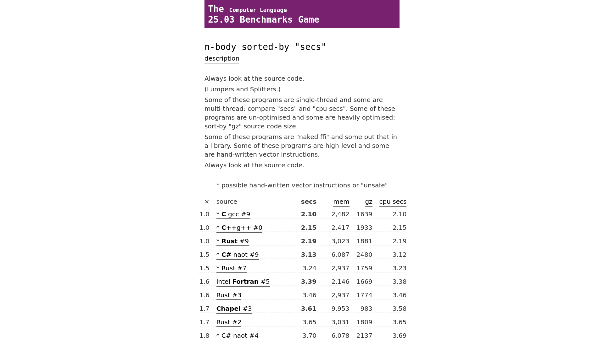
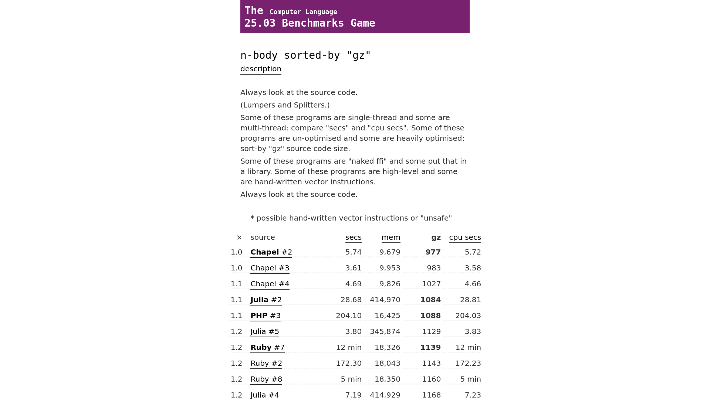
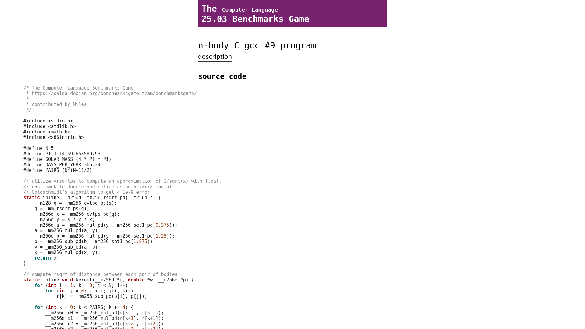
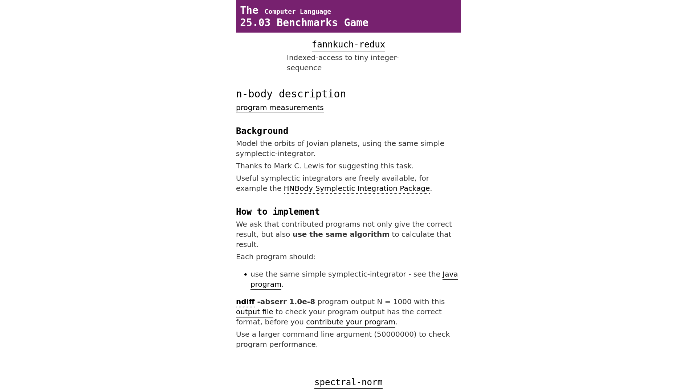
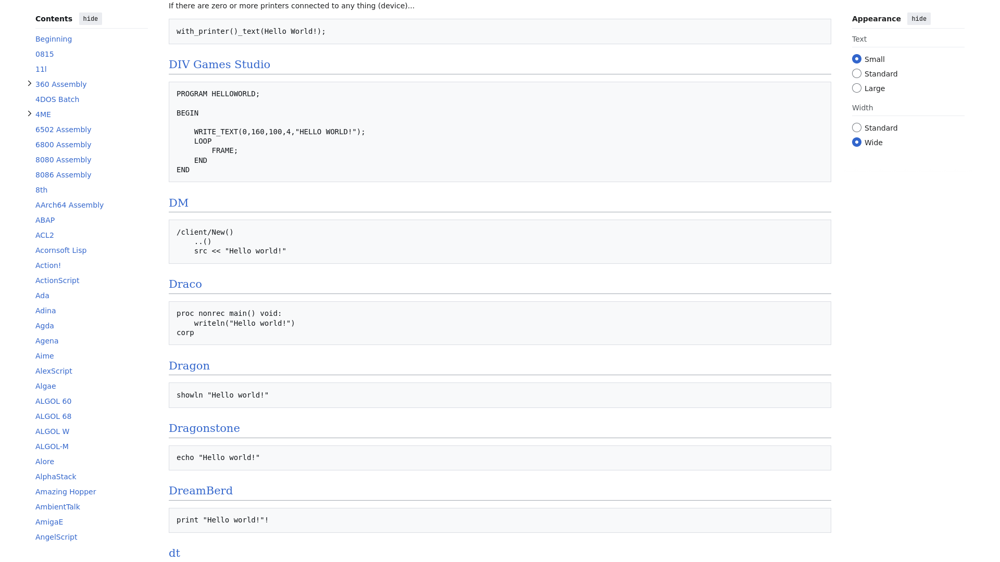
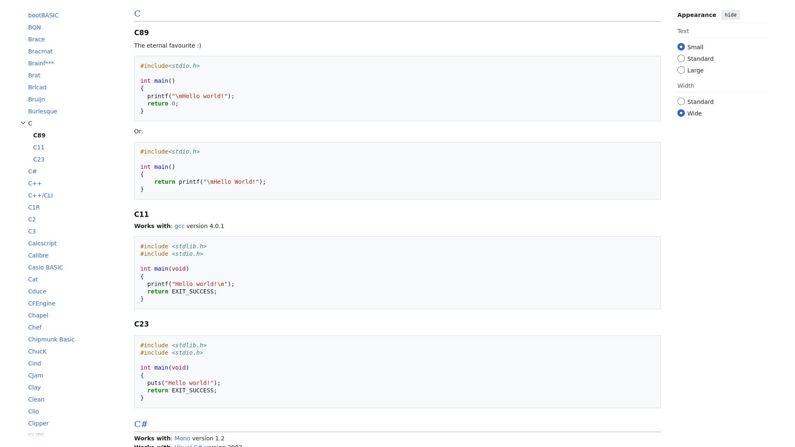
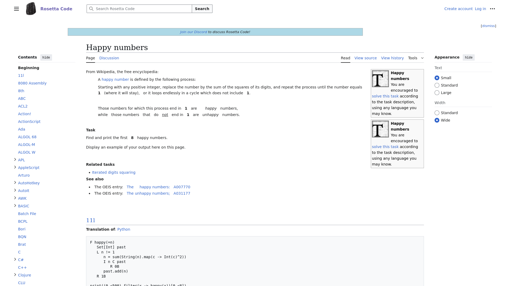

# Entrega 2 — Público-alvo e análise de concorrência

**Data:** 02/09/2026  
**Status:** 🟩 concluída  
**Responsabilidade mínima:** cada integrante analisa pelo menos 1 concorrente/interface representativa; a equipe produz síntese comparativa.

## Objetivo da atividade

Compreender soluções do mesmo domínio **e também interfaces familiares ao público-alvo**. O objetivo não é copiar telas, mas identificar convenções, padrões, affordances percebidas, problemas recorrentes, expectativas e oportunidades de design.

> **Concorrente não precisa ser idêntico ao produto.** Pode atuar na mesma área, resolver objetivo semelhante ou disputar a mesma necessidade. Quando não houver concorrente direto, use produtos análogos e softwares que o público já utiliza.

### Para TCCs que não previam interface

Não procure apenas um “concorrente do algoritmo”. Investigue **interfaces profissionais que materializam atividades semelhantes** às que o usuário escolhido precisaria realizar.

Exemplos:

- TCC de banco de dados → consoles de administração, ferramentas para DBA, monitoramento e análise de consultas;
- TCC de LLM/ML → painéis de experimentos, gestão de modelos/datasets, comparação de métricas, revisão de resultados;
- TCC de análise de dados → dashboards, ferramentas de BI, filtros, relatórios e exploração;
- TCC de infraestrutura/API → portais administrativos, observabilidade, logs, gestão de credenciais e uso;
- TCC de cibersegurança → consoles de alertas, triagem, histórico e auditoria.

A pergunta é: **“que convenções esse perfil já conhece para executar tarefas equivalentes?”**

## Entrada obrigatória da Entrega 1

Retome o mapa inicial de alternativas e produtos citado na Entrega 1. Aqui a equipe deixa de trabalhar apenas com impressão inicial e passa a **investigar sistematicamente** cada solução.

| Item citado na Entrega 1 | Tipo | Por que foi citado | Status inicial | Decisão nesta entrega |
|---|---|---|---|---|
| Rosetta Code | análogo | porque é uma biblioteca de códigos e algoritmos em diversas linguagens | F | analisar |
| Debian Benchmark Game | concorrente | porque agrega resultados de algoritmos diferentes, em diversas linguagens, em tabelas | F | analisar |
| Repositório do Dave Plummer | processo manual | porque agrega resultados de algoritmos de números primos em mais de 100 linguagens | F | não possui interface |

Se uma hipótese da Entrega 1 for confirmada ou refutada durante esta análise, atualize `H01`, `H02`... em [`../RASTREABILIDADE.md`](../RASTREABILIDADE.md).

## 1. Público-alvo desta análise

Desenvolvedores de software com acesso a um computador e à internet que tenham interesse ou precisem comparar a performance de linguagens de programação para diversos ou determinados problemas.

## 2. Concorrentes diretos/indiretos

### Análise C01 — Debian Benchmark Game

**Autor(a):** Augusto Pereira Teixeira — 24.123.008-5  
**Tipo:** direto
**Link oficial:** https://benchmarksgame-team.pages.debian.net/benchmarksgame/index.html
**Data de acesso:** 02/09/2026

### Análise C02 — Rosetta Code

**Autor(a):** João Pedro Bazoli Palma - 24.123.041-6  
**Tipo:** análogo
**Link oficial:** https://rosettacode.org/wiki/Rosetta_Code
**Data de acesso:** 02/09/2026

#### Contexto e proposta

C01 - É um exemplo básico de um agregador de problemas e resultados, organizando-os em tabelas. Tem uma interface simples e explica cada problema para o usuário entender o que uma linguagem ser "boa" ou "rápida" significa para aquela questão específica.

C02 - Biblioteca de soluções de diversos problemas de programação conceituados resolvidos em centenas de linguagens de programação, organizando-os em blocos de código. Tem uma interface simples, com uma breve descrição de cada problema e uma lista de blocos de código embaixo.  

#### Funcionalidades relevantes

##### C01
| Funcionalidade | Como é realizada | Evidência/print | Observação de IHC |
|---|---|---|---|
| visualização de tabelas | é selecionado um problema na página inicial |  | é básica, mas tem as funções de filtragem esperadas de uma ferramenta desse tipo |
| filtragem de tabelas | é selecionado um tipo de campo na tabela |  | os filtros na tabela são só em ordem decrescente, mas funcionam |
| leitura de código-fonte | é selecionado um item da tabela |  | o código possui destaque de sintaxe e detalhes sobre a compilação (comandos usados, tempo, etc) |
| descrição do problema | é selecionado o botão "description" na página da tabela |  | descrições curtas, com instruções de implementação em outras linguagens para submissão |

##### C02
| Funcionalidade | Como é realizada | Evidência/print | Observação de IHC |
|---|---|---|---|
| visualização de um problema em centenas de linguagens diferentes | é selecionada uma *task* na lista de *tasks* do site |  | é básica e difícil (por conta da quantidade de linguagens), mas faz o que é previsto |
| destaque de sintaxe para certas linguagens | é feito automaticamente |  | não está presente em todas as linguagens (seria humanamente impossível fazer isso para todas) |
| descrição da *task* | no topo da página de cada *task* existe uma descrição dela |  | as descrições são bem diretas, e explicam de forma curta o que cada problema faz |

#### Experiência do usuário e opiniões

Use avaliações públicas, relatos, estudos, testes próprios ou outra fonte identificável. Não trate opinião isolada como verdade universal.

#### Preço/modelo de negócio

C01 - É gratuito, aberto e disponível na internet.
C02 - É gratuito, aberto e disponível na internet. Usa o padrão *wiki* para as suas páginas (parecido com a Wikipédia e similares).

#### Padrões e tendências percebidos

C01 - É feito com desenvolvedores/programadores experientes em mente. O usuário tem que saber o que cada programa testa interpretando as descrições e/ou o código. A interface é simples mas não acessível (não há explicação do que cada coisa faz).
C02 - É feito com desenvolvedores/programadores e interessados em mente. O usuário tem que ter um conhecimento mínimo dos problemas representados na biblioteca. A interface é simples mas não é direta (muitas abas,nenhuma explicação de navegação)  

#### Pontos positivos, limitações e lições

##### C01
| Ponto | Evidência | Implicação para nosso projeto |
|---|---|---|
| interface simples | não há menus ou opções, só links para outras páginas | nossa interface pode ser parecida, **?** mas não sabemos se a simplicidade implicará em uma interface pior ou mais rasa |
| não há representação gráfica | só tabelas | nosso projeto terá gráficos para uma representação visual dos resultados |
| é possível comparar versões antigas do mesmo algoritmo | existem casos em que as linguagens têm várias versões do mesmo algoritmo | isso pode ser interessante para guardar histórico, assim como para a reprodutibilidade do(s) problema(s) |

##### C02
| Ponto | Evidência | Implicação para nosso projeto |
|---|---|---|
|opções de filtragem| não existem opções de filtragem por linguagem ou tipo de problema | nosso projeto terá opções de filtragem |
|interface simples | não há menus ou opções, só links para outras páginas | nossa interface pode ser parecida, **?** mas não sabemos se a simplicidade implicará em uma interface pior ou mais rasa  |
|variedade enorme de problemas e linguagens  | biblioteca contendo centenas de problemas resolvidos em centenas de linguagens  | nosso projeto vai ter uma quantidade limitada de problemas e linguagens  |

## 3. Softwares que o público-alvo usa no cotidiano

Analise interfaces que moldam a expectativa do público, mesmo que não sejam concorrentes.

### TODO: REVISAR

| Software | Por que o público usa | Padrões relevantes | O que aprender |
|---|---|---|---|
| StackOverflow | desenvolvedores usam para pesquisar/pedir ajuda com programação | padrões de fórum (post/respostas/comentários, junção em categorias/subcategorias, etc) | esse tipo de usuário espera uma interface feita para ele, sem "dar as mãos" nem "ensinar o básico" |
| GitHub | repositórios de código e projetos de software | padrão git (repositórios, READMEs) | formas de mostrar arquivos de código e documentação |

## 3.1 Padrões de interface relevantes ao escopo de IHC

Registre somente padrões encontrados nas soluções analisadas e que possam ter relação com objetivos reais da equipe.

| Padrão observado | Produto(s) | Para qual tarefa serve | Vantagem percebida | Risco/limitação | Aplicável ao nosso escopo? |
|---|---|---|---|---|---|
| relatório | C01,C02 | Uma breve descrição dos problemas de programação representados nos produtos | Ajuda o usuário a compreender melhor o problema que está sendo resolvido  | Problemas complexos podem precisar de descrições complexas | sim |
| histórico + filtros | C01 | Melhor comparação/observação de resultados | O usuário consegue ver problemas específicos, assim como versões anteriores deles | **?** Histório pode ser difícil de implementar | sim |
| comparação de resultados | C01| Visualizar benchmarks de diferentes linguagens de programação em diversos problemas de forma clara e direta | facilita com que o usuário compare varias linguagens de programação  | Métricas podem ficar confusas caso a visualização seja muito simples | sim |

> O objetivo não é concluir “todo concorrente tem dashboard, então teremos um”. O padrão só será adotado se apoiar uma tarefa rastreável.

## 4. Síntese comparativa da equipe

| Critério | C01 | C02 | Oportunidade para o projeto |
|---|---|---|---|
| Navegação | Sim | Não | Inspiração para o nosso projeto |
| Feedback/estado | Não | Não | N.A. |
| Prevenção/recuperação de erro | Não | Não | N.A. |
| Terminologia | Sim | Sim | Termos e vocabulário técnico específicos |
| Acessibilidade | Não | Parcial | C02 tem opções de tamanho de fonte |
| Eficiência | Sim | Sim | Ambos são sites leves e sem *bloatware* |

## 5. Recomendações derivadas

Liste recomendações com origem explícita.

- **RC01:** Fazer interface leve e direta - derivada de C01
- **RC02:** Mostrar resultados na mesma página de forma concisa - derivada de C02
- **RC03:** Descrever brevemente os problemas para o usuário entender como funcionam e como implementá-los - derivada de C01 e C02
- **RC04:** Métricas bem descritas (tempo, tamanho, compactação, etc) - derivada de C01

## Referências

[Debian Benchmark Game](https://benchmarksgame-team.pages.debian.net/benchmarksgame/index.html)
[Rosetta Code](https://rosettacode.org/wiki/Rosetta_Code)

## Checklist

- [X] O mapa inicial de alternativas da Entrega 1 foi revisitado e aprofundado.
- [X] Hipóteses relevantes sobre mercado/padrões foram atualizadas na rastreabilidade quando surgiram evidências.
- [X] Há pelo menos uma análise completa por integrante.
- [X] Cada análise contém prints legíveis da interface.
- [X] Prints mostram telas/estados relevantes, não apenas logos/homepage.
- [X] Foram analisados concorrentes e/ou interfaces representativas ao público.
- [X] Em TCC sem interface original, foram investigadas ferramentas profissionais análogas às atividades do usuário escolhido.
- [X] Padrões como dashboard, relatório, filtros e CRUD foram analisados como soluções para tarefas, não como requisitos automáticos.
- [X] Opiniões de UX têm fonte.
- [X] A síntese compara critérios comuns e produz recomendações.
- [X] Não há “copiar porque o concorrente faz”; há justificativa de adequação ao público/contexto.
